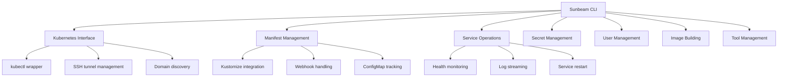

# Sunbeam CLI

**Sunbeam CLI** is a powerful local development stack manager for Kubernetes-based applications. It simplifies cluster management, service operations, secret handling, and manifest deployment for development environments.

[](LICENSE)
[](https://www.python.org/)
[](docs/)

## Quick Start

```bash
# Install Sunbeam CLI
pip install .

# Start your local cluster
sunbeam up

# Apply manifests
sunbeam apply

# Check status
sunbeam status
```

## Features

- **Cluster Management**: Bring up and tear down local Kubernetes clusters with Lima VM
- **Service Operations**: Manage services, view logs, and perform health checks
- **Secret Management**: Secure credential handling with OpenBao integration
- **Manifest Management**: Kustomize-based manifest application with domain substitution
- **User Management**: Identity management for development environments
- **Tool Bundling**: Automatic download and management of required binaries
- **Multi-environment Support**: Local development and production deployment

## Installation

### Prerequisites

- Python 3.11+
- Docker
- Lima (for local VM management)
- kubectl, kustomize, helm (automatically managed by Sunbeam)

### Install from Source

```bash
# Clone the repository
git clone https://github.com/your-org/sunbeam.git
cd sunbeam/cli

# Install dependencies
pip install .

# Verify installation
sunbeam --help
```

### Install in Development Mode

```bash
pip install -e .
```

## Usage

### Basic Commands

```bash
# Start local cluster
sunbeam up

# Check cluster status
sunbeam status

# Apply all manifests
sunbeam apply

# Apply specific namespace
sunbeam apply lasuite

# View service logs
sunbeam logs ory/kratos

# Restart services
sunbeam restart ory/kratos

# Stop cluster
sunbeam down
```

### Production Deployment

```bash
# Set SSH host for production
export SUNBEAM_SSH_HOST=user@your-server.example.com

# Apply production manifests
sunbeam apply --env production --domain sunbeam.pt --email ops@sunbeam.pt

# Check production status
sunbeam status --env production
```

## Documentation

Comprehensive documentation is available in the [`docs/`](docs/) directory:

- **[CLI Reference](docs/cli-reference.md)** - Complete command reference
- **[Core Modules](docs/core-modules.md)** - Detailed module documentation
- **[API Reference](docs/api-reference.md)** - Full API documentation
- **[Usage Examples](docs/usage-examples.md)** - Practical usage patterns
- **[Utility Modules](docs/utility-modules.md)** - Helper function documentation

## Configuration

### Environment Variables

| Variable | Description | Required |
|----------|-------------|----------|
| `SUNBEAM_SSH_HOST` | SSH host for production access | Production only |
| `SUNBEAM_ACME_EMAIL` | ACME email for cert-manager | Optional |

### Configuration Files

Sunbeam uses kustomize overlays for environment-specific configuration:

```
infrastructure/
├── base/              # Base manifests
└── overlays/         # Environment overlays
    ├── local/        # Local development
    └── production/   # Production deployment
```

## Architecture



## Development Workflow

### Building and Deploying

```bash
# Build a component
sunbeam build proxy

# Build and push to registry
sunbeam build proxy --push

# Build, push, and deploy
sunbeam build proxy --deploy
```

### User Management

```bash
# Create user
sunbeam user create user@example.com --name "User Name"

# Set password
sunbeam user set-password user@example.com "password123"

# List users
sunbeam user list
```

### Secret Management

```bash
# Seed all credentials
sunbeam seed

# Verify VSO + OpenBao integration
sunbeam verify
```

## Contributing

Contributions are welcome! Please follow these guidelines:

1. **Fork the repository** and create your branch
2. **Follow conventional commits** for commit messages
3. **Add tests** for new features
4. **Update documentation** for changes
5. **Submit a pull request**

### Development Setup

```bash
# Clone repository
git clone https://github.com/your-org/sunbeam.git
cd sunbeam/cli

# Install development dependencies
pip install -e .[dev]

# Run tests
python -m pytest sunbeam/tests/
```

### Commit Message Format

```
<type>(<scope>): <description>

<body>

<footer>
```

**Types:**
- `feat`: New feature
- `fix`: Bug fix
- `docs`: Documentation changes
- `style`: Code style changes
- `refactor`: Code refactoring
- `test`: Adding or modifying tests
- `chore`: Maintenance tasks

## Troubleshooting

### Common Issues

**Cluster not starting:**
```bash
limactl list
limactl start sunbeam
```

**Manifest apply failures:**
```bash
sunbeam k8s get events -A
sunbeam logs cert-manager/cert-manager
```

**Secret sync problems:**
```bash
sunbeam verify
sunbeam bao status
```

### Debugging

```bash
# Direct kubectl access
sunbeam k8s get pods -A

# Describe resources
sunbeam k8s describe pod ory/kratos-abc123

# View events
sunbeam k8s get events --sort-by=.metadata.creationTimestamp
```

## License

This project is licensed under the MIT License - see the [LICENSE](LICENSE) file for details.

## Acknowledgments

- Kubernetes community for the excellent ecosystem
- Kustomize team for manifest management
- OpenBao for secret management
- Lima for VM management

## Contact

For questions, issues, or contributions:

- **GitHub Issues**: [https://github.com/your-org/sunbeam/issues](https://github.com/your-org/sunbeam/issues)
- **Documentation**: [https://your-org.github.io/sunbeam-cli](https://your-org.github.io/sunbeam-cli)