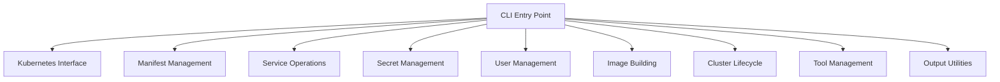
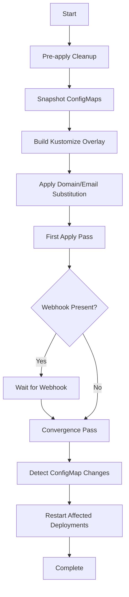

# Core Modules

Sunbeam's functionality is organized into several core modules, each responsible for specific aspects of cluster and service management.

## Module Overview



## Kubernetes Interface (`sunbeam.kube`)

The Kubernetes interface module provides core functionality for interacting with Kubernetes clusters.

### Key Functions

#### `set_context(ctx: str, ssh_host: str = "")`
Set the active kubectl context and optional SSH host for production tunnels.

#### `kube(*args, input=None, check=True)`
Run kubectl commands against the active context with automatic SSH tunnel management.

#### `kube_out(*args) -> str`
Run kubectl and return stdout.

#### `kube_ok(*args) -> bool`
Return True if kubectl command succeeds.

#### `kube_apply(manifest: str, server_side: bool = True)`
Apply YAML manifest via kubectl.

#### `kustomize_build(overlay: Path, domain: str, email: str = "") -> str`
Build kustomize overlay with domain/email substitution.

### Environment Management

- **Local Development**: Uses Lima VM with context `sunbeam`
- **Production**: Supports SSH tunneling to remote clusters
- **Domain Handling**: Automatic domain discovery and substitution

### SSH Tunnel Management

The module automatically manages SSH tunnels for production environments:

```python
# Automatic tunnel opening when needed
def ensure_tunnel():
    # Check if tunnel is already open
    # Open SSH tunnel if needed
    # Verify tunnel is working
```

## Manifest Management (`sunbeam.manifests`)

Handles kustomize-based manifest building, application, and lifecycle management.

### Key Functions

#### `cmd_apply(env: str = "local", domain: str = "", email: str = "", namespace: str = "")`
Main entry point for manifest application:

1. **Pre-apply Cleanup**: Remove immutable resources and stale secrets
2. **ConfigMap Snapshotting**: Track ConfigMap versions for restart detection
3. **Kustomize Build**: Build overlay with domain/email substitution
4. **Namespace Filtering**: Apply only specific namespaces if requested
5. **Webhook Waiting**: Wait for cert-manager webhook before convergence
6. **ConfigMap Change Detection**: Restart deployments when ConfigMaps change

#### `pre_apply_cleanup(namespaces=None)`
Clean up resources that must be recreated:
- Delete completed Jobs
- Remove test Pods
- Prune stale VaultStaticSecrets

#### `_wait_for_webhook(ns: str, svc: str, timeout: int = 120) -> bool`
Wait for webhook services to become ready.

#### `_restart_for_changed_configmaps(before: dict, after: dict)`
Restart deployments when mounted ConfigMaps change.

### Manifest Processing Flow



## Service Operations (`sunbeam.services`)

Provides service management capabilities including status checks, log viewing, and restarts.

### Key Functions

#### `cmd_status(target: str | None)`
Show pod health across managed namespaces:
- Filter by namespace or namespace/service
- Color-coded status indicators
- VSO secret sync status

#### `cmd_logs(target: str, follow: bool)`
Stream logs for a service:
- Automatic pod selection via labels
- Follow mode for real-time logging

#### `cmd_get(target: str, output: str = "yaml")`
Get raw kubectl output for resources.

#### `cmd_restart(target: str | None)`
Rolling restart of services:
- Restart all, by namespace, or specific service
- Uses predefined service list

### Managed Namespaces

```
["cert-manager", "data", "devtools", "ingress", "matrix", "media", "monitoring", "ory", "stalwart", "storage", "vault-secrets-operator", "vpn", "wfe"]
```

### Service Health Monitoring

The status command provides comprehensive health monitoring:

- **Pod Status**: Running, Completed, Failed, Pending
- **Readiness**: Container ready ratios
- **VSO Sync**: VaultStaticSecret and VaultDynamicSecret synchronization

## Secret Management (`sunbeam.secrets`)

Handles credential generation and OpenBao integration.

### Key Functions

#### `cmd_seed()`
Generate and store all credentials in OpenBao.

#### `cmd_verify()`
End-to-end VSO + OpenBao integration test.

### OpenBao Integration

- **Root Token Management**: Automatic injection into bao commands
- **Secret Generation**: Comprehensive credential seeding
- **Integration Testing**: Verify VSO-OpenBao connectivity

## User Management (`sunbeam.users`)

Provides identity management for development environments.

### Key Functions

#### User Operations
- `cmd_user_list(search: str)` - List identities
- `cmd_user_get(target: str)` - Get identity details
- `cmd_user_create(email: str, name: str, schema_id: str)` - Create identity
- `cmd_user_delete(target: str)` - Delete identity
- `cmd_user_recover(target: str)` - Generate recovery link
- `cmd_user_disable(target: str)` - Disable identity
- `cmd_user_enable(target: str)` - Enable identity
- `cmd_user_set_password(target: str, password: str)` - Set password

### Identity Management

- Email-based identity lookup
- Schema-based identity creation
- Session management and recovery
- Password management

## Image Building (`sunbeam.images`)

Handles container image building, pushing, and deployment.

### Key Functions

#### `cmd_build(what: str, push: bool, deploy: bool)`
Build Docker images with optional push and deploy:

- **Build Targets**: proxy, integration, kratos-admin, meet, frontend apps
- **Push Integration**: Automatic registry pushing
- **Deploy Integration**: Manifest application and rollout

#### `cmd_mirror()`
Mirror amd64-only La Suite images for ARM compatibility.

## Cluster Management (`sunbeam.cluster`)

Handles cluster lifecycle operations.

### Key Functions

#### `cmd_up()`
Bring up the full local cluster including Lima VM.

#### `cmd_down()`
Tear down the Lima VM and cluster.

## Tool Management (`sunbeam.tools`)

Automatic binary management for required tools.

### Key Features

- **Binary Caching**: Download and cache kubectl, kustomize, helm
- **SHA256 Verification**: Security verification of downloaded binaries
- **Version Pinning**: Specific versions for reproducibility
- **Automatic Updates**: Re-download when versions change

### Supported Tools

| Tool | Version | Purpose |
|------|---------|---------|
| kubectl | v1.32.2 | Kubernetes CLI |
| kustomize | v5.8.1 | Manifest customization |
| helm | v4.1.0 | Helm chart management |

## Output Utilities (`sunbeam.output`)

Consistent output formatting and user feedback.

### Functions

- `step(msg: str)` - Step headers
- `ok(msg: str)` - Success messages
- `warn(msg: str)` - Warnings
- `die(msg: str)` - Error messages with exit
- `table(rows: list, headers: list)` - Formatted tables

### Output Style Guide

```python
step("Starting cluster...")  # ==> Starting cluster...
ok("Cluster ready")          #     Cluster ready
warn("Low memory")          #     WARN: Low memory
die("Failed to start")      # ERROR: Failed to start (exits)
```