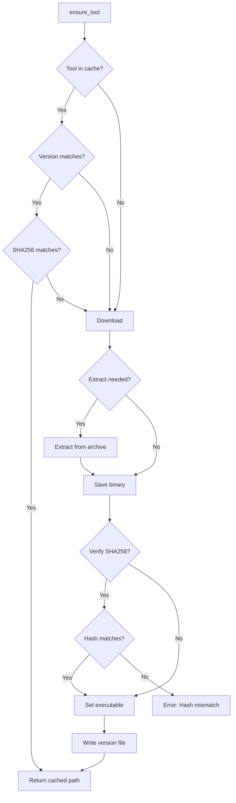

# Utility Modules

Sunbeam includes several utility modules that provide essential helper functionality.

## Output Utilities (`sunbeam.output`)

The output module provides consistent formatting for user feedback and status messages.

### Functions

#### `step(msg: str)`
Print a step header with `==>` prefix.

**Parameters:**
- `msg`: The message to display

**Example:**
```python
step("Starting cluster initialization...")
# Output: ==> Starting cluster initialization...
```

#### `ok(msg: str)`
Print a success or informational message with indentation.

**Parameters:**
- `msg`: The message to display

**Example:**
```python
ok("Cluster initialized successfully")
# Output:     Cluster initialized successfully
```

#### `warn(msg: str)`
Print a warning message to stderr.

**Parameters:**
- `msg`: The warning message

**Example:**
```python
warn("Low memory detected")
# Output:     WARN: Low memory detected
```

#### `die(msg: str)`
Print an error message and exit the program.

**Parameters:**
- `msg`: The error message

**Example:**
```python
die("Failed to connect to cluster")
# Output: ERROR: Failed to connect to cluster
# Exits with status code 1
```

#### `table(rows: list[list[str]], headers: list[str]) -> str`
Generate an aligned text table.

**Parameters:**
- `rows`: List of row data (list of strings)
- `headers`: List of column headers

**Returns:** Formatted table string

**Example:**
```python
table_data = table([
    ["pod-1", "Running", "2/2"],
    ["pod-2", "Pending", "0/1"]
], ["Name", "Status", "Ready"])

# Output:
# Name      Status    Ready
# -------------------------
# pod-1     Running   2/2
# pod-2     Pending   0/1
```

### Usage Patterns

```python
from sunbeam.output import step, ok, warn, die, table

# Progress reporting
step("Deploying application...")
ok("Namespace created")
ok("ConfigMaps applied")

# Error handling
if not cluster_ready:
    die("Cluster not ready - aborting deployment")

# Warning conditions
if memory_low:
    warn("System memory is low - performance may be affected")

# Tabular data display
pod_data = [
    ["kratos-abc", "Running", "2/2"],
    ["hydra-xyz", "Running", "1/1"]
]
print(table(pod_data, ["Pod", "Status", "Ready"]))
```

## Tool Management (`sunbeam.tools`)

The tools module handles automatic downloading, caching, and verification of required binaries.

### Constants

#### `CACHE_DIR`
Default cache directory: `~/.local/share/sunbeam/bin`

#### `TOOLS`
Dictionary of supported tools with version and download information:

```python
TOOLS = {
    "kubectl": {
        "version": "v1.32.2",
        "url": "https://dl.k8s.io/release/v1.32.2/bin/darwin/arm64/kubectl",
        "sha256": ""
    },
    "kustomize": {
        "version": "v5.8.1",
        "url": "https://github.com/kubernetes-sigs/kustomize/releases/download/...",
        "sha256": "",
        "extract": "kustomize"
    },
    "helm": {
        "version": "v4.1.0",
        "url": "https://get.helm.sh/helm-v4.1.0-darwin-arm64.tar.gz",
        "sha256": "82f7065bf4e08d4c8d7881b85c0a080581ef4968a4ae6df4e7b432f8f7a88d0c",
        "extract": "darwin-arm64/helm"
    }
}
```

### Functions

#### `ensure_tool(name: str) -> Path`
Ensure a tool is available, downloading and verifying if necessary.

**Parameters:**
- `name`: Tool name (must be in TOOLS dictionary)

**Returns:** Path to the executable

**Behavior:**
- Checks cache for existing binary
- Verifies version and SHA256 hash
- Downloads if missing or verification fails
- Extracts from archives if needed
- Makes executable and sets permissions
- Caches version information

**Example:**
```python
kubectl_path = ensure_tool("kubectl")
subprocess.run([str(kubectl_path), "version"])
```

#### `run_tool(name: str, *args, **kwargs) -> subprocess.CompletedProcess`
Run a tool, ensuring it's downloaded first.

**Parameters:**
- `name`: Tool name
- `*args`: Arguments to pass to the tool
- `**kwargs`: Additional subprocess.run parameters

**Returns:** CompletedProcess result

**Special Handling:**
- For kustomize: Adds CACHE_DIR to PATH so helm is found
- Automatically ensures tool is available before running

**Example:**
```python
result = run_tool("kustomize", "build", "overlays/local", 
                  capture_output=True, text=True)
print(result.stdout)
```

#### `_sha256(path: Path) -> str`
Calculate SHA256 hash of a file (internal utility).

**Parameters:**
- `path`: Path to file

**Returns:** Hexadecimal SHA256 hash

### Tool Management Workflow



### Error Handling

The module includes comprehensive error handling:

- **Unknown tools**: Raises `ValueError` for unsupported tools
- **Download failures**: Propagates network errors
- **SHA256 mismatches**: Raises `RuntimeError` with expected vs actual hashes
- **Permission issues**: Handles file system errors gracefully

## Helper Functions

### Target Parsing (`sunbeam.kube.parse_target`)

```python
def parse_target(s: str | None) -> tuple[str | None, str | None]:
    """Parse 'ns/name' -> ('ns', 'name'), 'ns' -> ('ns', None), None -> (None, None)."""
```

**Examples:**
```python
parse_target("ory/kratos")    # ("ory", "kratos")
parse_target("lasuite")       # ("lasuite", None)
parse_target(None)             # (None, None)
```

### Domain Replacement (`sunbeam.kube.domain_replace`)

```python
def domain_replace(text: str, domain: str) -> str:
    """Replace all occurrences of DOMAIN_SUFFIX with domain."""
```

**Example:**
```python
manifest = "apiVersion: v1\nkind: Service\nspec:\n  host: app.DOMAIN_SUFFIX"
domain_replace(manifest, "example.com")
# Returns: "apiVersion: v1\nkind: Service\nspec:\n  host: app.example.com"
```

### Lima VM IP Discovery (`sunbeam.kube.get_lima_ip`)

```python
def get_lima_ip() -> str:
    """Get the socket_vmnet IP of the Lima sunbeam VM (192.168.105.x)."""
```

Uses multiple fallback methods to discover the Lima VM IP address.

### Domain Discovery (`sunbeam.kube.get_domain`)

```python
def get_domain() -> str:
    """Discover the active domain from cluster state."""
```

Discovery priority:
1. Gitea inline-config secret
2. La Suite OIDC provider configmap
3. Lima VM IP with sslip.io domain